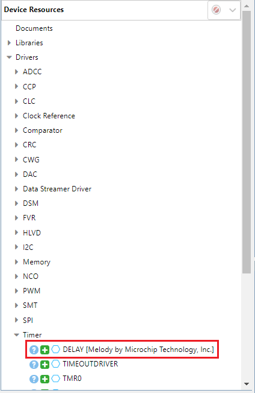
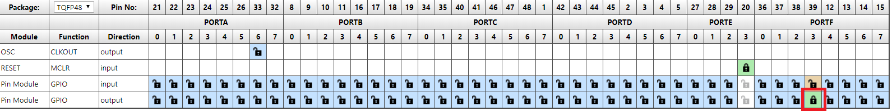
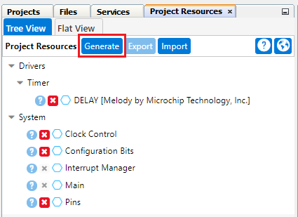

<!-- Please do not change this logo with link -->
[](https://www.microchip.com)

# Blink with Timer

This example demonstrates how to use the MPLAB Code Configurator (MCC) to configure an LED to blink periodically. The example uses the Pin Manager to configure the pin and generate an API with which the pin is later interfaced. Also, the delay driver is used to implement periodic interrupt between each time the pin output is toggled.

## Related Documentation

- [MPLAB Code Configurator](https://www.microchip.com/en-us/development-tools-tools-and-software/embedded-software-center/mplab-code-configurator)
- [PIC18F57Q47 Data Sheet](https://ww1.microchip.com/downloads/en/DeviceDoc/PIC18F27-47-57Q43-Data-Sheet-DS40002147E.pdf)
- [PIC18F57Q47 Family Product Page](https://www.microchip.com/wwwproducts/en/PIC18F57Q43)

## Software Used

- [MPLAB® X IDE](http://www.microchip.com/mplab/mplab-x-ide) **5.45** or newer
- [MPLAB® XC8](http://www.microchip.com/mplab/compilers) **2.31** or a newer compiler 
- [MPLAB® Code Configurator (MCC)](https://www.microchip.com/mplab/mplab-code-configurator) **4.1.0** or newer 
- [MPLAB® Melody Library](https://www.microchip.com/en-us/development-tools-tools-and-software/embedded-software-center/mplab-code-configurator) **1.37.25** or newer
- [Microchip PIC18F-Q Series Device Support pack](https://packs.download.microchip.com/) **1.11.185** or newer Device Pack

## Hardware Used
- [Microchip PIC18F47Q57 Curiosity Nano Evaluation Kit](https://www.microchip.com/Developmenttools/ProductDetails/DM164150)

## Setup
MCC with Melody library was used to implement this example as shown in the following sections.

### Delay Driver
The delay driver was simply added to the project by locating it in the Device Resources pane on the left side in MCC.



### Pin Configuration
The pin controlling the onboard LED on the Curiosity Nano board was configured using the Pins Grid View.  The Pins Grid View is accessed by clicking on the Pins line in Project Resources window. Then the pin connected to the LED0, RF3, was selected as an output by clicking the corresponding padlock symbol.



The pin was also configured with a custom name to make the generated API more readable. The internal weak pullup feature was also selected for this pin.


### Code Implementation
Click Generate within the Project Resources Menu.




## Operation
In this code example MCC was used to configure and initialize the pin used. Once the drivers were generated, the code needs an additional function to operate correctly. This function uses the pin manager API to toggle the LED on and off. Then the pin manager and delay driver APIs were used to toggle the onboard LED pin every one second.

```c
int main(void)
{
    SYSTEM_Initialize();

    while(1)
    {
        LED0_Toggle();
        DELAY_milliseconds(1000);
    }    
}
```

## Summary

The example has shown how MCC can be used to configure the pins of the PIC18F57Q47 device.
